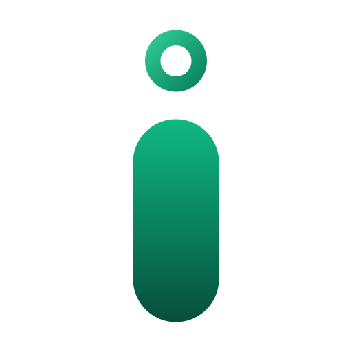

<p align="center">
  
</p>

<h1 align="center">iMemo Smart Clipboard</h1>

<p align="center">
  A high-performance, lightweight, and privacy-focused cross-platform clipboard manager designed for developers, writers, and power users.
</p>

<p align="center">
  <a href="https://github.com/ichshakib/imemo-smart-clipboard/releases"></a>
  <a href="LICENSE"></a>
  
  <a href="https://github.com/ichshakib/imemo-smart-clipboard/pulls"></a>
</p>

---

## 🌟 Overview

**iMemo** reimagines your system clipboard for speed, simplicity, and total privacy. It runs silently in the background, automatically indexing text snippets, code blocks, URLs, and image copies into an instant-access HUD. With customizable global keybindings (`Alt + V`) and zero cloud telemetry, your clipboard history remains 100% on-device and instantly retrievable.

The project includes:
- **Desktop Application (`desktop/`)**: Built with Electron, React 18, TypeScript, and a pure lightweight **Vanilla CSS** design system (zero Tailwind runtime overhead).
- **Web Landing Page (`index.html`, `assets/`)**: Standalone, SEO-optimized web portal and multi-platform download hub.

---

## ✨ Features

- **⚡ Smart Multi-Format Capture**: Automatically detects and timestamps copied text, code fragments, color hex codes, and clipboard images.
- **🚀 Global Instant HUD**: Summon your clipboard history anywhere with `Alt + V` in sub-15ms response time.
- **📋 Instant Paste**: Direct paste simulation into whichever code editor, terminal, or document is currently active.
- **🔍 Sub-Millisecond Search**: Fast full-text keyword search across your entire saved history.
- **⭐ Starred Vault**: Permanently pin recurring snippets, boilerplate, auth tokens, and notes so they never roll off history.
- **🖼️ Native Image Cache**: Preserves screenshots and copied graphics with high-resolution thumbnail previews.
- **👁️ Dedicated Preview Window**: Inspect long snippets, multi-line JSON, SQL queries, or full-resolution images before pasting.
- **🛡️ 100% Local & Air-Gapped**: Zero network requests, zero telemetry beacons, and zero cloud sync leaks. Everything is stored on your local disk.
- **🪶 Ultra-Lightweight**: Zero TailwindCSS bloat. Complete UI bundle parses in under 1 millisecond.

---

## ⌨️ Keyboard Shortcuts

| Shortcut | Action | Description |
| :--- | :--- | :--- |
| <kbd>Alt</kbd> + <kbd>V</kbd> | **Toggle HUD** | Summon or hide the iMemo clipboard window |
| <kbd>&uarr;</kbd> / <kbd>&darr;</kbd> | **Navigate** | Cycle through saved clipboard items |
| <kbd>Enter</kbd> | **Instant Paste** | Paste selected item into the active application |
| <kbd>Space</kbd> | **Inspect** | Open detailed floating preview window |
| <kbd>Ctrl</kbd> + <kbd>S</kbd> | **Star / Unstar** | Pin snippet to your favorites vault |
| <kbd>Esc</kbd> | **Dismiss** | Close window and return focus to workspace |

*(All shortcuts are customizable in the Settings panel)*

---

## 🚀 Getting Started

### Prerequisites

- [Node.js](https://nodejs.org/) (v20 or higher)
- [pnpm](https://pnpm.io/) (v9 or higher)

### Installation & Setup

1. **Clone the repository:**
   ```bash
   git clone https://github.com/ichshakib/imemo-smart-clipboard.git
   cd imemo-smart-clipboard
   ```

2. **Run the Desktop App:**
   ```bash
   cd desktop
   pnpm install
   pnpm dev
   ```

3. **Preview the Web Landing Page:**
   Open `index.html` directly in your browser, or start a local static server:
   ```bash
   python -m http.server 8080
   # or
   npx serve .
   ```

### Building for Production

To package native desktop installers for your operating system:

```bash
cd desktop
pnpm build
```

This generates production-ready installers in `desktop/release/0.1.0/`:
- **Windows**: `.exe` (NSIS setup x64)
- **macOS**: `.dmg` (Universal Apple Silicon & Intel)
- **Linux**: `.AppImage`, `.deb`, `.rpm`

---

## 📂 Project Structure

```text
imemo-smart-clipboard/
├── desktop/                  # Electron desktop application
│   ├── electron/             # Main process, preload bridge & clipboard listeners
│   ├── src/                  # React 18 UI components & views
│   │   ├── components/       # HistoryView, StarredView, SearchView, SettingsView, Preview, Navbar
│   │   └── index.css         # Lightweight pure Vanilla CSS design system
│   ├── public/               # Application icons (mac, win, png) & branding assets
│   ├── electron-builder.json5# Multi-platform distribution configuration
│   └── package.json          # Desktop dependencies & scripts
├── assets/                   # Web landing page assets
│   ├── css/style.css         # Responsive monochrome zinc design system
│   ├── js/main.js            # Client-side OS detection, theme switcher, FAQ accordion
│   └── images/               # Branding logos and multi-resolution favicons
├── index.html                # Standalone web landing page & download hub
├── .github/                  # GitHub Actions CI/Release workflows & issue templates
├── CONTRIBUTING.md           # Contribution guidelines
├── CODE_OF_CONDUCT.md        # Contributor Covenant Code of Conduct
└── LICENSE                   # MIT License
```

---

## 🤝 Contributing

Contributions are welcome! Please check out [CONTRIBUTING.md](CONTRIBUTING.md) for step-by-step instructions on setting up your local environment, coding guidelines, and submitting pull requests.

---

## 📬 Contact & Support

If you have questions, feedback, or need assistance, feel free to reach out:

- **Maintainer**: Shakib Khan ([@ichshakib](https://github.com/ichshakib))
- **Email**: [ichshakib@gmail.com](mailto:ichshakib@gmail.com)
- **GitHub Issues**: [https://github.com/ichshakib/imemo-smart-clipboard/issues](https://github.com/ichshakib/imemo-smart-clipboard/issues)
- **Repository**: [https://github.com/ichshakib/imemo-smart-clipboard](https://github.com/ichshakib/imemo-smart-clipboard)

---

## 📄 License

This project is licensed under the **MIT License** — see the [LICENSE](LICENSE) file for details.